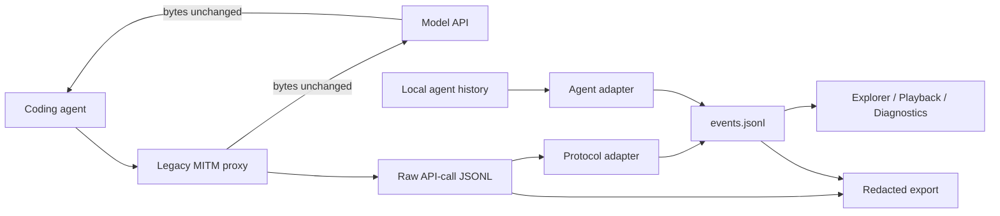

<div align="center">
  

  <h1>Agent Trace Workbench</h1>
  <p><strong>Local-first DevTools for observing, replaying, and diagnosing coding-agent sessions.</strong></p>

  <a href="https://github.com/Riordon666/agent-trace-workbench/actions/workflows/ci.yml"></a>
  <a href="https://nodejs.org/"></a>
  <a href="LICENSE"></a>
  
  

  <p><a href="README.zh-CN.md">简体中文</a> · <a href="docs/ARCHITECTURE.md">Architecture</a> · <a href="docs/ADAPTER_COMPATIBILITY.md">Adapters</a> · <a href="docs/ADAPTER_SDK.md">Adapter SDK</a> · <a href="docs/TRACE_DIFF.md">Trace Diff</a> · <a href="docs/FAQ.md">FAQ</a> · <a href="docs/MAINTENANCE.md">Maintenance</a> · <a href="ROADMAP.md">Roadmap</a> · <a href="CONTRIBUTING.md">Contributing</a></p>
</div>

---

Agent Trace Workbench (ATW) brings API traffic, local agent history, tool calls, usage, and diagnostics into one local Session. It is intended for debugging questions such as:

- What did the agent actually send to the model?
- Which model, tool calls, token usage, and response events were observed?
- Did an SSE stream end cleanly, or was it truncated?
- Does the local agent history agree with the captured API traffic?
- Can I inspect or share a redacted portable trace without inventing missing reasoning?

ATW does **not** infer chain-of-thought. If a provider omits, encrypts, or redacts thinking, the UI reports it as `unavailable` and preserves only the fields actually observed.

<p align="center">
  <strong>Observe → Replay → Compare → Export</strong><br /><br />
  <br />
  <sub>30-second walkthrough using synthetic local Session data. No real conversation content is included.</sub>
</p>

## Current status

`v0.2.0` is the first public preview. Source and the GitHub Release are available; the npm package must not be considered published until it appears on the npm registry.

| Layer | Support | Evidence and boundary |
|---|---|---|
| Agent history | Claude Code | Local JSONL discovery/import with synthetic fixtures and tests |
| Agent history | Codex CLI | Observed rollout formats, version detection, synthetic fixtures and tests |
| Agent history | Gemini CLI | `main` preview: official JSONL session format, version detection, synthetic fixture and API integration tests; no local live smoke yet |
| Agent history | OpenCode | `main` preview: official CLI list/export interface, synthetic fixture/API integration tests, and Windows 1.18.11 discovery smoke |
| Live capture | Legacy MITM | HTTPS CONNECT interception, raw response forwarding, local redacted capture |
| Protocol | Anthropic Messages | Streaming SSE/JSON parsing, thinking/signature/tool/usage fields when present |
| Protocol | OpenAI Responses | Protocol adapter and synthetic conformance tests; live capture is currently optimized for Anthropic Messages |
| Compression | identity, gzip, deflate, br, zstd | Capture-side decoding; unsupported encodings are not advertised upstream |
| Playback | Session Explorer and timeline | Historical inspection; this is not deterministic re-execution |
| Comparison | Session A vs Session B | Duration, token, tool, explicit file, command-failure, and retry-signal deltas with metric-source disclosure |
| Analytics | Tokens, cost, tools, request timeline | One source per category; cost is explicitly `observed`, `estimated`, or `unavailable`; event browser is server-paginated |
| Export | `.atwtrace` v2 and annotation directory | Checksummed import/export, Trace Schema v1, privacy findings; manual review is always required |

Gemini CLI and OpenCode history adapters, Session Comparison, and portable `.atwtrace` support are available on `main` for upcoming releases. They do not expand live capture beyond the protocol boundary stated above. See the [adapter compatibility and evidence matrix](docs/ADAPTER_COMPATIBILITY.md).

The public CommonJS [Adapter SDK](docs/ADAPTER_SDK.md) provides versioned Agent/Protocol Adapter contracts and deterministic conformance runners. `npm run test:adapters` runs the same contract against every bundled Adapter using synthetic fixtures only.

## Quick start from source

Requirements: Node.js 20 or newer, npm, and OpenSSL for MITM certificate generation.

```bash
git clone https://github.com/Riordon666/agent-trace-workbench.git
cd agent-trace-workbench
npm install
npm run setup
npm run workbench
```

Open <http://127.0.0.1:5177/>.

The `v0.2.0` CLI can also be tested locally before npm publication:

```bash
npm link
atw doctor
atw setup
atw
```

`atw` selects an available local port and opens the browser. Use `atw --no-open` for headless environments or `atw --port 5177` to require a specific port.

When launched through the CLI, mutable data is stored outside the npm installation in the current user's application-data directory (`%LOCALAPPDATA%\\agent-trace-workbench` on Windows, `~/Library/Application Support/agent-trace-workbench` on macOS, or `$XDG_DATA_HOME/agent-trace-workbench` on Linux). Set `ATW_DATA_DIR` to override the root. A source checkout launched with `npm run workbench` continues to use the repository's ignored runtime directories.

## Capture a Claude Code session

1. Run `atw setup` once to generate the local MITM certificate.
2. Create or select a Session in the workbench.
3. Start the Legacy MITM proxy, normally on `127.0.0.1:8888`.
4. Start official capture.
5. Launch Claude Code with the proxy and CA environment shown by the workbench.
6. Complete the task, wait for active requests to reach zero, and stop capture.
7. Inspect the Session Explorer, raw trace status, replay timeline, and Diagnostics.

ATW forwards upstream response bytes to the client unchanged. A separate capture path decodes supported compression and records Anthropic SSE events, including `thinking_delta` and `signature_delta` when the upstream actually sends them.

## Security warning: local MITM certificate

Legacy MITM capture is powerful and sensitive:

- It uses a locally generated CA certificate and private key under the configured certificate directory (the CLI uses its per-user data directory; a source checkout defaults to `certs/`).
- Keep the proxy bound to localhost and restrict `TARGET_HOST` whenever possible.
- Leaving `TARGET_HOST` empty allows the local proxy to intercept all HTTPS hosts reached through it.
- Captures can contain prompts, source code, paths, tool inputs, tool output, cookies, and credentials.
- Remove the certificate from the trust store when it is no longer needed; deleting the local certificate files alone does not remove OS trust.
- Never commit or share certificate keys, Session data, raw traces, or unreviewed exports.

See [SECURITY.md](SECURITY.md) and [docs/PRIVACY.md](docs/PRIVACY.md).

## Data flow



The raw trace is the source of truth for captured wire events. Normalized events are derived views used by the UI and diagnostics.

## Session files

```text
sessions/<session-id>/
├── config.json
├── proxy-status.json
├── https-intercepts.json
├── raw/api-calls/*_apicall.jsonl
├── events.jsonl
├── agent-history.jsonl
├── claude-history.jsonl
└── diagnostics-result.json
```

Runtime directories are gitignored. Portable Trace export scans known credentials and personal-data patterns, records category counts, and verifies every archive entry with SHA-256. Prompts and tool output may still contain project-specific secrets no generic scanner can recognize.

The CLI places these directories under its per-user data root. `ATW_DATA_DIR`, `WORKBENCH_SESSIONS_DIR`, `WORKBENCH_CERT_DIR`, and `WORKBENCH_ANNOTATION_EXPORT_DIR` provide explicit overrides.

## Compare Sessions

Open **Session Explorer → Session Comparison**, select A and B, then run the comparison. The table reports `B − A` for duration, input/output tokens, tool calls, explicitly observed file reads/edits, failed commands, retry signals, requests, and errors.

ATW selects one normalized source per metric category to avoid double-counting a Session that contains both protocol capture and agent history. Source choices and limitations are shown beside the results. File and retry counts are evidence-based and may be lower than the real count when an adapter does not expose the required fields.

The comparison also classifies the result as `equivalent`, `changed`, or `regression`. Errors, failed commands, retries, incomplete requests, reasoning loss, and thresholded duration increases can trigger regressions; token or tool-count changes alone cannot. The same rules are available for verified portable traces through [`atw diff`](docs/TRACE_DIFF.md).

## Session Analytics

Open **Session Explorer → Session Analytics** to inspect per-model tokens, tool-call counts/failures/durations, and a request timeline. The common-event browser uses server-side 100-event pages so the browser keeps a bounded DOM even when `events.jsonl` is large.

Cost has three explicit states:

- `observed`: an upstream adapter exposed a numeric cost field;
- `estimated`: every attributable Provider/model matched the local, date-stamped standard USD catalog;
- `unavailable`: token usage, Provider identity, model identity, or an exact rate was unavailable.

Estimates are not invoices. They exclude non-standard processing tiers, regional premiums, storage, grounding, tool fees, media tokens, taxes, discounts, and contract pricing. Set `WORKBENCH_PRICING_FILE` to use a reviewed local catalog. See [Analytics and Cost Semantics](docs/ANALYTICS.md).

## CLI

```text
atw [start] [--port <port>] [--no-open]
atw setup
atw doctor
atw export <session-id> [--output <file.atwtrace>]
atw open <file.atwtrace> [--session-id <id>] [--port <port>] [--no-open]
atw diff <baseline.atwtrace> <candidate.atwtrace> [--json] [--fail-on-regression] [--thresholds <file.json>]
atw --version
```

- `start`: starts the local web server, chooses a free port when needed, and opens a browser.
- `setup`: generates the local MITM certificate with OpenSSL. Trust is an explicit OS-level action.
- `doctor`: checks Node.js, `node-pty`, OpenSSL, certificate presence, and the default port.
- `export`: creates a redacted, checksummed `.atwtrace` without overwriting an existing file.
- `open`: verifies every entry, imports to a new Session when an ID already exists, and starts the workbench.
- `diff`: verifies two traces and compares normalized evidence without importing or executing them; `--fail-on-regression` exits with code 2 for CI.

The portable trace contains `manifest.json`, `metadata.json`, `events.jsonl`, `diagnostics.json`, `privacy-report.json`, `checksums.txt`, and optional redacted `raw/` files. It supports historical playback and read-only diff, not command or model re-execution. See the [Portable Trace Format](docs/TRACE_FORMAT.md), [Trace Diff semantics](docs/TRACE_DIFF.md), and machine-readable [schemas](schemas/).

## Privacy and reasoning

- No account, hosted backend, analytics, or telemetry is required.
- Authorization/API-key fields, cookies, private keys, common provider tokens, home paths, emails, and IP addresses are scanned and redacted in portable exports.
- A clean scanner result means only “no known pattern was detected,” never “safe to share.”
- `signature` is opaque encrypted provider data; ATW preserves it and never tries to decrypt it.
- Empty thinking plus a signature is shown as unavailable thinking, not reconstructed text.

## Development

```bash
npm ci
npm run test:adapters
npm run check
npm pack --dry-run
npm run test:package
```

Tests use synthetic fixtures only. Never add real prompts, histories, captures, credentials, certificates, usernames, customer data, or private filesystem paths.

The public branch is `main`. See [CONTRIBUTING.md](CONTRIBUTING.md), [SECURITY.md](SECURITY.md), and the [release checklist](docs/RELEASE_CHECKLIST.md).

## Known limitations

- Live capture requires local proxy and certificate configuration and varies by client/OS.
- Current raw per-call capture is focused on Anthropic-compatible `/v1/messages` traffic.
- Some providers intentionally omit visible thinking and return only an opaque signature.
- Playback reconstructs observed events; it does not re-run tools or guarantee deterministic execution.
- Automated redaction is not a complete privacy scrubber.
- Event browsing is paginated, but generating a full-session Analytics summary still reads the normalized event file and can consume server memory for very large Sessions.

## License

Code is available under the [MIT License](LICENSE). Artwork and bundled third-party assets may have separate terms documented in [THIRD_PARTY_NOTICES.md](THIRD_PARTY_NOTICES.md).
